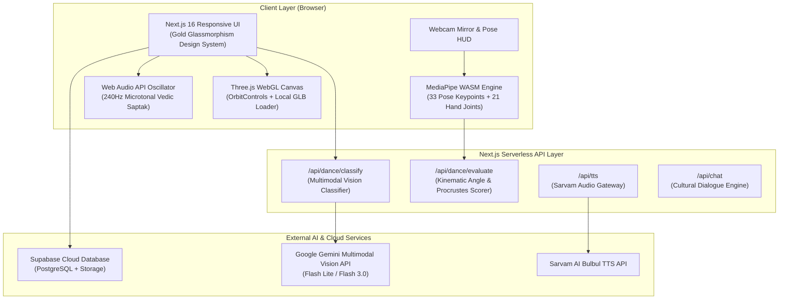

# 🏛️ Āryāvarta (आर्यावर्त)
### *Next-Generation Multimodal AI Platform for Indian Cultural Heritage, Classical Shastras & 3D Spatial Preservation*

[](https://nextjs.org/)
[](https://react.dev/)
[](https://www.typescriptlang.org/)
[](https://threejs.org/)
[](https://developers.google.com/mediapipe)
[](https://ai.google.dev/)
[](https://tailwindcss.com/)
[](LICENSE)

---

## 📑 Table of Contents
1. [🌟 Executive Summary & Problem Context](#-executive-summary--problem-context)
2. [🏛️ Core Platform Pillars](#️-core-platform-pillars)
   - [1. Heritage 3D Explorer & Sacred Monuments](#1--heritage-3d-explorer--sacred-monuments)
   - [2. Nritya: AI Classical Dance Mirror & Vision Classifier](#2--nritya-ai-classical-dance-mirror--vision-classifier)
   - [3. Sangeet: Vedic Microtonal Synthesizer & Raga Matrix](#3--sangeet-vedic-microtonal-synthesizer--raga-matrix)
   - [4. History Atlas & Verified Dynastic Timeline](#4--history-atlas--verified-dynastic-timeline)
   - [5. Virasat & Roots: Diaspora Heritage Journey](#5--virasat--roots-diaspora-heritage-journey)
   - [6. Artisan Bazaar & GI-Tagged Living Traditions](#6--artisan-bazaar--gi-tagged-living-traditions)
3. [📐 Biomechanical Evaluation & Shastric Tuning](#-biomechanical-evaluation--shastric-tuning)
   - [How the AI Evaluates Posture Geometry](#how-the-ai-evaluates-posture-geometry)
   - [Vedic Microtonal Frequency Reference](#vedic-microtonal-frequency-reference-madhya-sa--240-hz)
4. [🏗️ System Architecture & Workflow](#️-system-architecture--workflow)
5. [🔌 API Reference & Endpoints](#-api-reference--endpoints)
6. [📂 Repository Directory Structure](#-repository-directory-structure)
7. [🚀 Installation & Local Reproduction](#-installation--local-reproduction)
8. [🔒 Security, Privacy & Push Protection](#-security-privacy--push-protection)
9. [🏆 Smart India Hackathon (SIH) Alignment](#-smart-india-hackathon-sih-alignment)
10. [📄 License & Acknowledgments](#-license--acknowledgments)

---

## 🌟 Executive Summary & Problem Context

India possesses one of the world's most intricate and ancient living cultural ecosystems, spanning thousands of years of architectural marvels, classical dance canons (*Natya Shastra*), melodic scalar systems (*Melakarta & Ragas*), and artisanal traditions. However, existing cultural preservation efforts face critical challenges:
- **Passive & Static Media**: Most archives consist of flat 2D images, text PDFs, or disconnected museum catalogs with zero interactive feedback.
- **Pedagogical Shastric Disconnect**: Classical performing arts require strict biomechanical posture precision (e.g., *Tribhanga*, *Aramandi*, *Chowka*), but traditional learning lacks accessible, real-time AI correction.
- **Fragmented Identity**: Indian diaspora and younger generations lack experiential, participatory gateways into their roots.

### The Āryāvarta Solution
**Āryāvarta (आर्यावर्त)** is a unified, multi-sensory web and spatial computing ecosystem that brings ancient shastras to life through:
- **WebGL 3D Photogrammetry**: Offline-capable local GLB rendering for monuments like Kailasa Temple and the Taj Mahal.
- **Client-Side Computer Vision**: Real-time 33-point skeletal posture tracking and Hastha mudra analysis running directly in the browser via WebAssembly without video streaming to the cloud.
- **Multimodal Neural Vision**: Accurate automatic classification distinguishing classical traditions from celebrated regional folk dances (**Bhangra, Garba, Ghoomar, Lavani, Bihu, Chhau, Yakshagana, etc.**).
- **Acoustic Synthesizer**: Pure Vedic harmonic ratios synthesized dynamically via the Web Audio API.

---

## 🏛️ Core Platform Pillars

### 1. 🛕 Heritage 3D Explorer & Sacred Monuments
- **Offline High-Polygon Rendering**: Custom Three.js renderer loading local GLB models (`/models/tajmahal.glb` @ 38 MB, `/models/ellora_caves.glb` @ 18 MB) with smooth orbit controls, auto-centering, and damping.
- **3D Coordinate Hotspots**: Interactive architectural, sculptural, and historical markers pinned in 3D vector space that reveal curated cultural insights upon click.
- **Dynamic Lighting & Shadow Shaders**: Atmospheric lighting, directional sunlight simulation, and material reflectance tuned to Indian sandstone and marble.
- **Sarvam AI Audio Narratives**: Native multilingual Indian voice synthesis (Hindi, Tamil, Telugu, Bengali, English) narrating historical contexts.

### 2. 💃 Nritya: AI Classical Dance Mirror & Vision Classifier
- **33-Joint MediaPipe Vision**: Real-time skeletal pose extraction running at 60 FPS in the user's browser with zero latency.
- **Natya Shastra Kinematic Engine**: Mathematical angular constraints for all 8 Sangeet Natak Akademi classical traditions:
  - **Odissi**: *Tribhanga* three-bend posture (Griva head tilt towards right ear, Vaksha upper torso shift to left, Kati hip deflection right, Kunchita Pada left heel elevation).
  - **Bharatanatyam**: *Aramandi* diamond half-squat (knee abduction > 140°), erect vertical spine, Natyarambha horizontal arm plane.
  - **Kathak**: Upright *Samapada* spinal axis, *Urdhva Hasta* overhead arm arch, *Tatkar* grounded foot positioning.
  - **Kathakali**: Deep martial *Mandala* squat, extreme knee abduction, flared *Vaksha* chest.
  - **Kuchipudi, Mohiniyattam, Manipuri, and Sattriya**.
- **Hastha Mudra Analysis**: Hand landmark tracking identifying classical mudras (*Alapadma* blooming lotus spread vs. *Aradhapataka* aligned flag).
- **Discriminative AI Scoring Dossier**: Computes overall percentage, pedagogical grade (*Uttama / Madhyama / Prathama*), Procrustes alignment, and joint-by-joint feedback.
- **Multimodal Dance Classifier**: Powered by Google Gemini multimodal vision, distinguishing the 8 classical dances from celebrated Indian folk dances (**Bhangra, Garba, Giddha, Dandiya, Ghoomar, Kalbelia, Lavani, Bihu, Chhau, Yakshagana, Rouf**).

### 3. 🎵 Sangeet: Vedic Microtonal Synthesizer & Raga Matrix
- **Pure Harmonic Synthesis**: Built on Web Audio API oscillators synthesizing pure sine swara frequencies from the root tonic (Madhya Sa @ 240 Hz).
- **Vedic Shruti Intervals**: Synthesizes pure intervals derived from the natural harmonic series:
  - *Shadjam (Sa)*: 1.000 (240.0 Hz)
  - *Shuddha Rishabham (Re)*: 9/8 (270.0 Hz)
  - *Shuddha Gandharam (Ga)*: 5/4 (300.0 Hz)
  - *Shuddha Madhyamam (Ma)*: 4/3 (320.0 Hz)
  - *Panchamam (Pa)*: 3/2 (360.0 Hz)
  - *Shuddha Dhaivatam (Dha)*: 5/3 (400.0 Hz)
  - *Shuddha Nishadham (Ni)*: 15/8 (450.0 Hz)
  - *Tara Shadjam (Sa')*: 2.000 (480.0 Hz)
- **72 Melakarta Scheme & Master Classical Scales**: Interactive scalar catalog with Arohana (ascending) and Avarohana (descending) note progression, emotional mood (*Rasa*), and circadian performance time (*Prahar*).

### 4. 📜 History Atlas & Verified Dynastic Timeline
- **1MB Curated Scholarly Corpus**: Verified database spanning ancient, medieval, and modern Indian history with **517+ verified citations**.
- **Interactive Dynastic Visualizer**: Maps the geopolitical footprints and architectural achievements of the Maurya, Gupta, Chola, Vijayanagara, Maratha, and Mughal eras.
- **Geospatial Timeline Integration**: Connects historical events directly to spatial coordinates across the Indian subcontinent.

### 5. 🌿 Virasat & Roots: Diaspora Heritage Journey
- **Cultural Identity Exploration**: Personalized onboarding helping members of the global Indian diaspora trace their ancestral linguistic, regional, and culinary traditions.
- **Shareable Heritage Dossiers**: Dynamically rendered digital certificates and identity cards celebrating ancestral lineage.

### 6. 🛍️ Artisan Bazaar & GI-Tagged Living Traditions
- **Empowering Traditional Artisans**: Direct digital bridge connecting traditional craftspeople with patrons, showcasing GI-tagged handicrafts (Bidriware, Madhubani paintings, Channapatna toys, Tanjore art, Pashmina weaving, Pattachitra).

---

## 📐 Biomechanical Evaluation & Shastric Tuning

### How the AI Evaluates Posture Geometry
- **Joint Angle Calculation**: Angles at key joints (knees, elbows, neck, and hips) are computed using vector dot products between connecting limb keypoints and converted to degrees ($0^\circ$–$180^\circ$).
- **Procrustes 3D Shape Alignment**: To score posture independently of dancer height, camera distance, or body proportions, 33 MediaPipe keypoints are normalized around the pelvic center (`midHip`) and scaled. The user's normalized silhouette is compared directly against canonical reference geometry derived from classical temple sculptures.
- **Directional Angular Checks**: Distinguishes proper lateral deflections (e.g. head tilted towards right shoulder vs. incorrectly to the left, or correct heel raised in *Kunchita Pada*).

### Vedic Microtonal Frequency Reference (Madhya Sa = 240 Hz)

| Swara | Vedic Note Name | Harmonic Ratio | Frequency | Shastric Interval |
|---|---|---|---|---|
| **Sa** | Shadjam | 1 : 1 | 240.0 Hz | Fundamental Tonic |
| **Ri** | Chatushruti Rishabham | 9 : 8 | 270.0 Hz | Major Second |
| **Ga** | Antara Gandharam | 5 : 4 | 300.0 Hz | Natural Major Third |
| **Ma** | Shuddha Madhyamam | 4 : 3 | 320.0 Hz | Perfect Fourth |
| **Pa** | Panchamam | 3 : 2 | 360.0 Hz | Perfect Fifth |
| **Dha** | Chatushruti Dhaivatam | 5 : 3 | 400.0 Hz | Major Sixth |
| **Ni** | Kakali Nishadham | 15 : 8 | 450.0 Hz | Major Seventh |
| **Sa'** | Tara Shadjam | 2 : 1 | 480.0 Hz | Octave Higher |

---

## 🏗️ System Architecture & Workflow



---

## 🔌 API Reference & Endpoints

### 1. `POST /api/dance/evaluate`
Evaluates a recorded skeletal keypoint sequence against classical Natya Shastra canons.
- **Request Body**:
  ```json
  {
    "danceId": "odissi",
    "poseName": "Tribhanga",
    "keypointSequence": [[[{"x": 0.52, "y": 0.19, "visibility": 0.95}, ...]]]
  }
  ```
- **Response**:
  ```json
  {
    "danceId": "odissi",
    "poseName": "Tribhanga",
    "overallScore": 96,
    "grade": "Uttama (Mastery / A+)",
    "procrustesScore": 99,
    "perJointBreakdown": {
      "headAndNeck": 91,
      "torsoLateralShift": 96,
      "hipDeflection": 97,
      "kneeAndFootwork": 92,
      "armsAndMudras": 97
    },
    "kinematicAngles": {
      "userHeadTilt": 156,
      "userLeftKnee": 177,
      "userRightKnee": 177,
      "userLeftElbow": 117,
      "userRightElbow": 121
    },
    "feedback": [
      "Magnificent execution of Tribhanga! Silhouette matches classical Natya Shastra sculptures.",
      "Optimal Griva head deflection (24°)! Head correctly inclined to right.",
      "Superb torso lateral shift! Fluid S-curve established."
    ]
  }
  ```

### 2. `POST /api/dance/classify`
Uploads a dance photo or video frame and identifies its tradition via multimodal vision.
- **Request**: `multipart/form-data` with `file: File`, `hints: string`.
- **Response**:
  ```json
  {
    "predictedDanceId": "bhangra",
    "danceName": "Bhangra",
    "nativeName": "ਭੰਗੜਾ",
    "state": "Punjab",
    "category": "folk",
    "confidence": 96,
    "isUncertain": false,
    "treatise": "Punjabi Folk Heritage & Baisakhi Harvest Traditions",
    "description": "The world-famous, high-energy folk dance of Punjab celebrating the Baisakhi harvest season...",
    "keyVisualSignatures": [
      "Vibrant Pagri (Turban) with fan-like Turla",
      "Kurta, colorful Chaadra wrap & waistcoat",
      "High-knee leaping and shoulder bounce movements"
    ],
    "folkNotice": "Bhangra is an iconic Indian folk harvest dance from Punjab..."
  }
  ```

---

## 📂 Repository Directory Structure

```
ARYAVARTA/
├── .gitignore                   # Comprehensive root gitignore (secrets, caches, scratch)
├── README.md                    # Detailed documentation and architecture guide
│
├── ai_gateway/                  # Standalone Python FastAPI Microservice
│   ├── app.py                   # FastAPI service for raga models & kinematics
│   ├── models/                  # Trained neural weights (.keras, .npy)
│   └── sample_audio/            # Acoustic reference clips (.wav)
│
├── data/                        # Curated Cultural Datasets & Shastric Repositories
│   ├── crafts_artisans.json     # GI-tagged handicraft database
│   ├── festivals_unified.json   # Pan-India cultural festival calendar
│   ├── heritage_showcase.json   # Architectural metadata for monuments
│   ├── history_corpus.json      # 1MB verified historical corpus (517+ citations)
│   └── ragas_unified.json       # 72 Melakarta & classical raga scales
│
└── web/                         # Primary Next.js 16 Web Application
    ├── .env.example             # Safe environment variable configuration template
    ├── next.config.ts           # Next.js & Turbopack build settings
    ├── package.json             # NPM dependencies & scripts
    ├── tsconfig.json            # TypeScript path aliasing (@/* -> src/*)
    │
    ├── public/
    │   ├── models/              # Offline 3D GLB Models (Taj Mahal, Ellora Caves)
    │   └── images/              # Curated monument and artisan handicraft photos
    │
    └── src/
        ├── app/
        │   ├── api/
        │   │   ├── dance/classify/   # Gemini multimodal vision classifier
        │   │   ├── dance/evaluate/   # Natya Shastra kinematic pose evaluator
        │   │   ├── chat/             # Pandit AI conversational agent
        │   │   ├── tts/              # Sarvam AI multilingual TTS proxy
        │   │   └── roots/narrate/    # Diaspora cultural storyteller
        │   ├── layout.tsx            # Global metadata, fonts & smooth scrolling
        │   └── page.tsx              # Main unified platform navigation hub
        │
        ├── components/
        │   ├── heritage/        # Three.js LocalGLBViewer & 3D Hotspot Explorer
        │   ├── nritya/          # MediaPipe Camera Mirror, Pose HUD, Modals
        │   ├── sangeet/         # Web Audio API Microtonal Synthesizer & Ragas
        │   ├── history/         # History Atlas & Dynastic Geospatial Timeline
        │   ├── bazaar/          # Artisan Handicrafts Showcase
        │   └── roots/           # Diaspora Identity & Heritage Onboarding
        │
        ├── context/             # Global Language & Audio Management Contexts
        └── lib/                 # Audio synthesis, MediaPipe loaders & geometry math
```

---

## 🚀 Installation & Local Reproduction

### Prerequisites
- **Node.js**: v18.17.0 or higher
- **npm**: v9.0.0 or higher (or `pnpm` / `yarn`)
- **Git** installed

### 1. Clone the Repository
```bash
git clone https://github.com/Rishabhbansal005/ARYAVARTA.git
cd ARYAVARTA/web
```

### 2. Install Node Dependencies
```bash
npm install
```

### 3. Configure Environment Variables
Copy the template configuration file:
```bash
cp .env.example .env.local
```
Add your API credentials to `.env.local`:
```env
# Google Gemini Multimodal AI Key (Required for Dance Classifier)
GEMINI_API_KEY=your_gemini_api_key_here

# Mapbox Token (Optional, for 3D GIS satellite maps)
NEXT_PUBLIC_MAPBOX_TOKEN=your_mapbox_token_here

# Groq LLM API Key (For cultural chatbot acceleration)
GROQ_API_KEY=your_groq_api_key_here

# Sarvam AI TTS Key (For authentic Indian voice synthesis)
SARVAM_API_KEY=your_sarvam_api_key_here

# Supabase Credentials (Optional, for persistent cloud sync)
NEXT_PUBLIC_SUPABASE_URL=https://your-project.supabase.co
NEXT_PUBLIC_SUPABASE_ANON_KEY=your_anon_key_here
```

### 4. Launch the Development Server
```bash
npm run dev
```
Open **`http://localhost:3000`** in your browser.

### 5. Build for Production
To validate the build bundle and TypeScript types:
```bash
npm run build
npm run start
```

---

## 🔒 Security, Privacy & Push Protection

1. **Client-Side Camera Processing**:
   - All webcam frames captured in the Nritya module are analyzed **locally** within the browser via Google MediaPipe WebAssembly.
   - Raw video frames are **never** uploaded or stored on any external server.
2. **GitHub Push Protection Compliance**:
   - Zero hardcoded API keys exist in git history.
   - All secret tokens reside exclusively in `.env.local` (protected via `.gitignore`).
   - A verified `.env.example` is supplied for seamless open-source onboarding.

---

## 🏆 Smart India Hackathon (SIH) Alignment

| Criterion | How Āryāvarta Solves It |
|---|---|
| **Innovation & Uniqueness** | Connects ancient classical shastras directly to real-time computer vision, 3D WebGL photogrammetry, and Vedic microtonal harmonic oscillators. |
| **Technical Complexity** | Combines Three.js local GLB rendering, MediaPipe skeletal tracking, Procrustes shape alignment, and Gemini multimodal vision in a unified Next.js 16 app. |
| **Real-World Impact** | Enables democratized cultural preservation, global diaspora education, and direct artisan economic empowerment. |
| **Offline Capability** | Both 3D monuments (`ellora_caves.glb`, `tajmahal.glb`) and MediaPipe vision engines run completely offline without cloud dependencies. |

---

## 📄 License & Acknowledgments

- **License**: Released under the **MIT License**.
- **Treatise References**: *Natya Shastra* (Bharata Muni), *Abhinaya Darpana* (Nandikesvara), *Sangita Ratnakara* (Sarangadeva), *Govinda Sangita Leelavilasa*.
- **Photogrammetry & Models**: Based on open cultural archives of the Archaeological Survey of India (ASI) and Creative Commons 3D scans.
